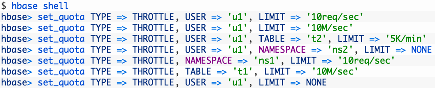

# HBase

比如：有两个用户使用HBase， User1和User2。起初都没有做限制，后来管理员决定User1的任务更加重要，因此为User2做了访问流量限制，使其减少对User1请求的资源争夺。下图为流控的效果：

相关设置命令以及参数如下图：

请参见Cloudera网站文章（[链接1](http://blog.cloudera.com/blog/2014/12/new-in-cdh-5-2-improvements-for-running-multiple-workloads-on-a-single-hbase-cluster/)，[链接2](http://blog.cloudera.com/blog/2015/05/new-in-cdh-5-4-apache-hbase-request-throttling/)）获取更多信息。