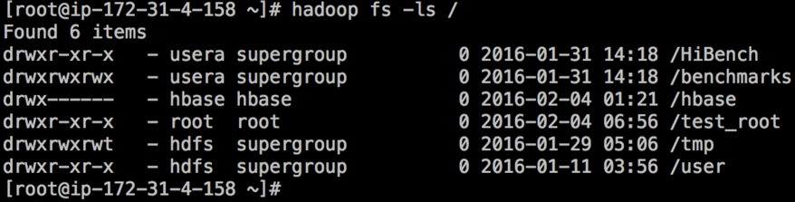
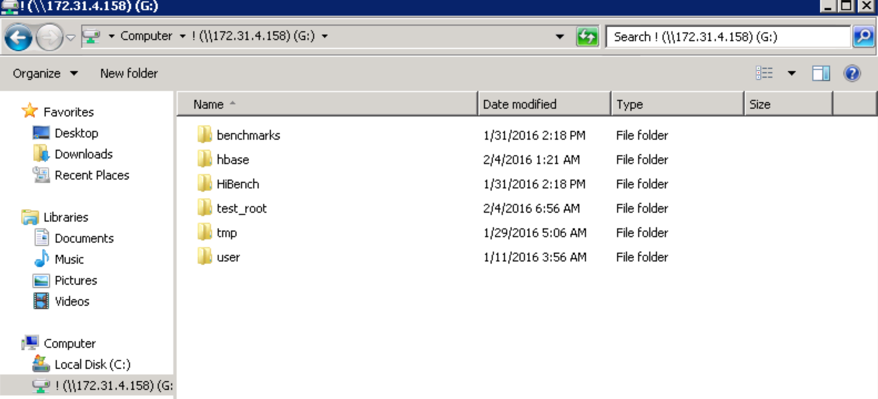
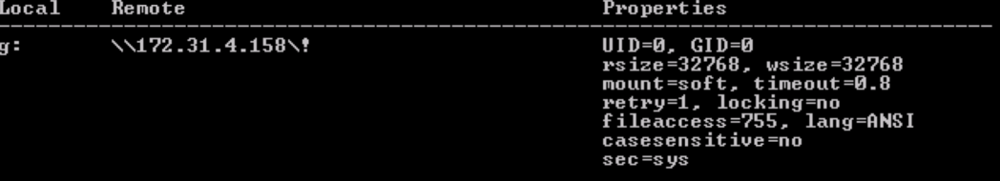

# 将HDFS挂载为NFS文件系统

## 说明
HDFS的访问除了通过API方式，HTTP Rest接口，也可以通过将HDFS以NFS的方式挂载为Linux或者Windows的“本地”文件系统，方便进行本地操作。如下图是通过HDFS Shell显示的HDFS根目录内容：


下图是通过Windows的NFS Client程序访问的HDFS：


## 步骤
### 配置HDFS NFS Gateway

在HDFS服务中添加对应的NFS Gateway角色即可，并启动NFS Gateway的服务（假设NFS服务启动在172.31.4.158节点上），通过

```
rpcinfo -p <NFS_SERVER_ADDRESS>
```

查看NFS是否监听在一些端口上，如下表所示：
```
    program vers proto   port  service
    100000    4   tcp    111  portmapper
    100000    3   tcp    111  portmapper
    100000    2   tcp    111  portmapper
    100000    4   udp    111  portmapper
    100000    3   udp    111  portmapper
    100000    2   udp    111  portmapper
    100005    1   udp   4242  mountd
    100005    2   udp   4242  mountd
    100005    3   udp   4242  mountd
    100005    1   tcp   4242  mountd
    100005    2   tcp   4242  mountd
    100005    3   tcp   4242  mountd
    100003    3   tcp   2049  nfs
```

### 在集群节点上验证NFS
可以选择一台Linux服务器来验证NFS的访问，在本地创建一个目录（/hdfs_nfs_mount）用来挂载HDFS NFS，然后执行下面的命令：

```
mount -t nfs -o vers=3,proto=tcp,nolock <NFS_SERVER_HOST>:/ /hdfs_nfs_mount ```

注：默认情况下NFS Gateway只提供‘/’用于共享，如果要修改这个路径，可以在高级配置中设置nfs.export.point参数。

为确保用户有正确的操作权限，使用NFS客户端的用户必须有NFS（HDFS）上对应目录的权限:
```
[root@ip-172-31-4-158 hdfs_nfs_mount]# ll                                     # 以root用户进行操作
total 3
drwxrwxrwx  3 usera 2584148964  96 Jan 31 14:18 benchmarks
drwx------ 11 hbase hbase      352 Feb  4 01:21 hbase
drwxr-xr-x  6 usera 2584148964 192 Jan 31 14:18 HiBench
drwxr-xr-x  4 root  root       128 Feb  4 13:50 test_root                    # test_root有root用户的操作权限
drwxrwxrwt 10 hdfs  2584148964 320 Jan 29 05:06 tmp
drwxr-xr-x 13 hdfs  2584148964 416 Jan 11 03:56 user
```

### 在Windows Server上配置NFS Client

### 添加服务
在Windows Server上挂载NFS，首先需要安装Windows的NFS Client Service，可以从”Administrative Tools” -> “Server Manager” -> “Roles” -> “Add Role” -> “File Service”添加NFS Client服务。

### 挂载目录
执行挂载命令，例：

```
mount -o nolock \\172.31.4.158\! G:
```
### 设置权限

挂载可以成功，但通常用户会发现没有权限操纵数据。因此执行mount命令，可以查看到一下信息：


默认情况下，UID和GID都是-2，说明客户端是以UID和GID为-2的用户去连接NFS Server （HDFS NFS Gateway），但NFS Gateway收到对应的UID/GID的请求后，会将其映射到NFS Gateway节点上对应的用户名，组名上；如果找不到对应，则会显示权限错误；所以在mount之前，需求修改默认的挂载UID和GID。

打开Windows注册表，在*HKEY_LOCAL_MACHINE\SOFTWARE\Microsoft\ClientForNFS\CurrentVersion\Default*中增加两个注册项AnonymousUid和AnonymousGid，类型都是DWORD的，值应该和NFS Gateway节点上相应用户和组的id对应，重启Windows Server并重新挂载NFS即可。
