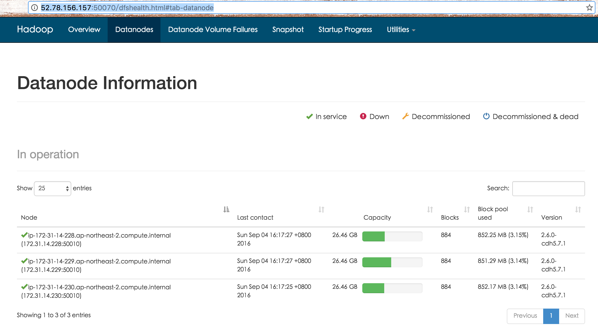

# 有节制地启动HDFS服务

## 重启准备阶段

1.	备份当前HDFS元数据，包括namedir下的FSImage以及JournalNode的EditsLog；
2.	记录先有文件数目以及block数目，包括pending deletion，miss以及under-replicated的数目和信息

## 启动阶段

### 启动NameNode
1. 尽量减少NameNode负担， 如去掉Debug日志输出等；
2. 恢复safemode退出缺省参数，如*dfs.namenode.safemode.threshold-pct*参数，保障集群数据正确，如：
``` xml
<property>
    <name>dfs.namenode.safemode.threshold-pct</name>
    <value>1f</value>
</property>
```
3. 使用iptables限制网络端口8020最大连接数为20：
``` shell
iptables -A INPUT -p tcp --dport 8020 -m connlimit --connlimit-above 20 --connlimit-mask 0 -j REJECT
```
其中8020为ipc端口
4. 启动NN服务，确保进入safemode

### 启动DataNode

1. 按20个DataNode节点一批，启动服务或者运行下面的命令：
``` shell
hdfs dfsadmin -triggerBlockReport datanode_host:ipc_port
```
其中，ipc_port的缺省值为50020
2. 操作完成后，等待NameNode退出SafeMode。
3. 使用命令，强制再次进入SafeMode：
``` shell
hdfs dfsadmin -safemode enter
```

### 检查

1. 登录NameNode的50070页面，的DataNode列表页，比如http://52.78.156.157:50070/dfshealth.html#tab-datanode
，统计每一个datanode的block的总数，确保与NameNode总数以及之前备份的block总数相同。

2. 退出HDFS安全模式：
``` shell
hdfs dfsadmin -safemode leave
```
3. 删除不必要的文件或日志，并对外提供服务。